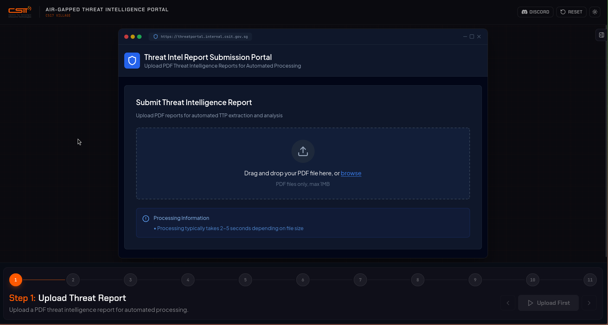
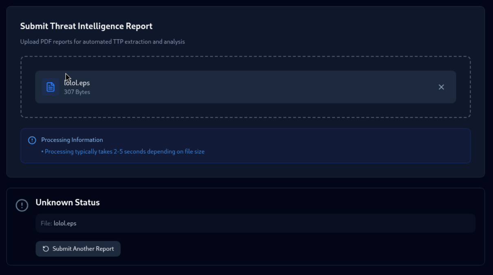
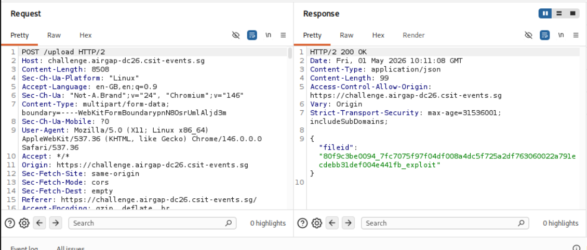
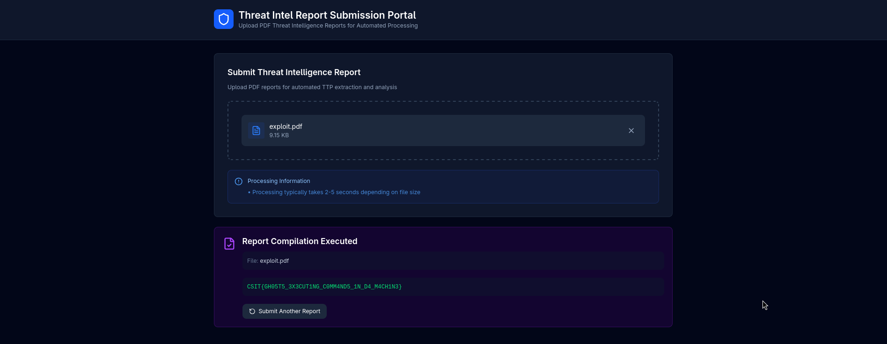

# DEFCON SINGAPORE 2026 CSIT's C517 Village Air-gapped CTF Challenge 

## Overview
Everyone in the Cybersecurity field has probably heard of DEF CON, it is only the largest hacking convention held annually and this year marks the first year DEF CON has landed in Singapore, or Southeast Asia for that matter.

Attending DEF CON Singapore 2026 was a pretty big deal for me not just because it’s DEF CON, but because it was actually my first time attending any cybersecurity conference at all. Walking into an environment filled with people way more experienced, with booths, villages, and challenges happening all around, was honestly a bit overwhelming at first. But at the same time, it was exactly the kind of space that makes you want to try things out and learn by doing.

I spent a good majority of my time working on the "Air-gapped" CTF run by the Centre for Strategic Infocomm Technologies (CSIT) at the C517 Village booth and barely finished on time to walk away with their hardware badge, which is the reward for completing their hardest challenge, the "level 3" challenge.

To be honest, this wasn’t an easy solve for me. There were quite a few moments where I wasn’t sure if I was even on the right track, and it definitely pushed me out of my comfort zone. But that’s also what made finally solving it so satisfying. Completing this challenge ended up being a huge confidence boost, it made everything feel a bit more “real,” like I could actually hold my own and keep improving. More than anything, it motivated me to keep learning and to dive deeper into future challenges.

# Air-gapped Challenge
The "Air-gapped" challenge was a unqiue 3 part challenge focusing on a `Threat Intel Report Submission Portal` that challenges one to really understand the infrastructure of the air-gapped network and from there exploit any weaknesses with the eventual goal of exfiltrating data.

For those who do not know what an air-gapped network is. It is essentially a complete physical isolation of a network/computer such computers outside of that network cannot connect to computers in that network.

Now that you have an idea of what an air-gap network is, without further ado, lets jump right into the challenges!

# Level 1: Interactive walkthrough of air-gapped network
The level 1 challenge is actually just an interactive walkthrough of this `Threat Intel Report Submission Portal` website. 



After uploading a `.pdf` file and clicking on `Process Report` then `Start Simulation` the website shows a really cool 3D animation of how the report is processed.


Now that we have an understanding of how the air-gapped network works, lets move on to the actual challenges

---

# Level 2: Ghost in the Shell
## Description
```
Our organisation operates a cross-domain Threat Hunting Platform. Analysts submit Threat Intelligence Reports (PDFs) on the Low-Side, which are processed automatically on the High-Side — an air-gapped classified environment where internal telemetry is stored and threat hunts are executed.

The two sides are connected by a one-way data diode. PDFs flow in; only a minimal hunt outcome code flows back. No raw data, no logs, no file contents — just one of eight predefined verdict codes.

The PDF processing pipeline uses Ghostscript 10.01.1 running on Ubuntu 22.04 x86-64 with the default SAFER sandbox enabled.

Our security researchers want to know: can a malicious threat intelligence report execute code inside the High-Side environment?

Your objective: Craft a PDF that achieves code execution on the High-Side. Your proof of success is receiving the REPORT_COMPILATION_EXECUTED hunt outcome in response to your submitted report.

    1. During processing, your uploaded PDF is the only file in /data/processing/. Your fileid is the filename minus the path prefix and .pdf suffix.
    2. To trigger the REPORT_COMPILATION_EXECUTED outcome, write a file named {fileid}.pwned to /data/vol_stage/secret/.


Flag: Returned in the response when REPORT_COMPILATION_EXECUTED is triggered. 

Flag Format: CSIT{...}
```


### Discovering the Exploit
The challenge description tells us that the PDF processing pipe line uses `Ghostscript 10.01.1`. `Ghostscript` is an open-source software suite and interpreter that is primarily used for rendering and interpreting files written in PostScript (PS) and PDF languages

Doing a quick search for `Ghostscript 10.01.1 exploit` shows CVE-2023-36664 vulnerability on Ghostscript prior to version 10.01.2 which leads to code execution (RCE).

The search almost immediately shows a [POC](https://github.com/jakabakos/CVE-2023-36664-Ghostscript-command-injection/tree/main) on github. 

Running the POC script injects the payload and generates a `.ps` (PostScript) or `.eps` (Encapsulated PostScript) file depending on the parameters given

But unfortunately, as seen in the screenshot below, the web app rejects `.eps` files.



Trying EPS to PDF converters online all failed, but after doing some research, I found out that ghostscript has a tool `eps2pdf` which converts `.eps` files to `.pdf`.
```bash
eps2pdf <input.eps> <output.pdf>
```

However, I also found out that Ghostscript automatically detects if input files are PDF or EPS regardless of the source format.

This means that we can simply rename the `.eps` file to `.pdf` and upload it and Ghostscript will treat it as an EPS and execute the code in the payload
```bash
mv exploit.eps exploit.pdf
```

However, I still wasnt getting any special response aside from the random results that were returned each time even when I uploaded the same file over and over again. I assumed that each result was `one of eight predefined verdict codes`, as mentioned in the challenge description,

I was quite lost at this moment, so I went back to the challenge description where I noticed it mentioned that there is a `default SAFER sandbox enabled`.

I remembered seeing a similar line in the POC's README.md.
```plaintext
Open this with Ghostscript to trigger the calculator (since version 9.50 you also have to use -dNOSAFER option):
```

This means that the Ghostscript service running on the backend needs to be executed with something like
```cmd
gs10011w64.exe -dNOSAFER .\file_injected.eps
```

However, the challenge description is telling us that Ghostscript is either ran with the `-dSAFER` option or is enabled by default as seen in newer versions.

Either ways, as the Ghostscript version we are interested in is after version 9.50, this means that the exploit we are looking at does not work.

Coincidentally, the blog for CVE-2023-36664 analysis I was looking at on vsociety led me to another `CVE-2024-29510`. Thank you vsociety :)

This CVE-2024-29510 bypasses SAFER sandbox, just what we are looking for! The exploitation script is even included in the blog. Read up on how the exploit works [here](https://www.vicarius.io/vsociety/posts/critical-vulnerability-in-ghostscript-cve-2024-29510), the author has very kindly explained how the exploit works.

What we are interested in is the last part of the PostScript script, which contains the payload that we can modify
```PostScript
(%pipe%gnome-calculator) (r) file
```

### Crafting the Payload
To complete the challenge, we need to create a file `{fileid}.pwnded` in `/data/vol_stage/secret/` directory. The backend will presumably see this and return the `REPORT_COMPILATION_EXECUTED` result along with the flag.

The challenge description the `fileid is the filename minus the path prefix and .pdf suffix`.

Woah, so that means that if I upload a file named `exploit.pdf` all I have to do is create a file named `exploit.pwned` in `/data/vol_stage/secret/` right?

Ok. So our payload should look like this
```PostScript
(%pipe%touch /data/vol_stage/secret/exploit.pwned) (r) file
```

And after uploading...nothing happened. I didn't get the `REPORT_COMPILATION_EXECUTED` verdict code and didn't get the flag.

Turns out, the name of the uploaded file is not the `fileid`.

Then what is this `fileid` and how do we get it?

I went back to doing reconnaisance and looking at the `POST /upload` request in BurpSuite, I saw a `fileid` in the response and this is exactly the `fileid` that we are looking for!


You may be wondering how I'm so sure of that, and if thats the case, that shows that you are thinking and following closely. Good job!

I know that this is the `fileid` because after the POST request to the `/upload` endpoint. The application continuously perform GET requests to `/readresult/{some_random_string_of_chars}` until it gets status code 200 OK.


Upon closer inspection, I noticed that this "random string of characters" is actually the `fileid` that is returned by the `/upload` endpoint.

This is exactly how `polling` works. `Polling` a common technique used by client applications when they are waiting for servers to finish processing, where they continuously send GET requests to an endpoint until they get a specific response, and how the multiple clients differentiate themselves is through the use of a unique ID, and that ID is usually gotten from the server's response towards their POST request.

The `fileid` changes on each upload and foolishly tried to analyse how the fileid was generated, you would realise the there is a certain format to it.
`salt_contenthash_filename`

The `contenthash` and `filename` can be replicated as they remain constant if the contents of the file and the filename are the same. The issue is the `salt` that changes on every upload, which makes it virtually impossible to guess the filename. Now, the reason why I called myself foolish is because there was a much simpler way, the challenge kindly told us that the `uploaded PDF file is the only file in /data/processing/`, so there's actually a much simpler way that I really should've thought of much earlier.

That is to get the filename directly from `/data/processing`. The final payload looks like this
```PostScript
(%pipe%id=$(ls | head -n 1); touch "/data/vol_stage/secret/$id.pwned") (r) file
```

If it was not specifically mentioned that there is only one file in the direcory, we can use a bruteforce method
```PostScript
(%pipe%for f in /data/processing/*.pdf; do id=$(basename "$f" .pdf); touch "/data/vol_stage/secret/$id.pwned"; done) (r) file closefile
```

And after uploading, we finally get the flag!

```
CSIT{GH05T5_3X3CUT1NG_C0MM4ND5_1N_D4_M4CH1N3}
```



Thanks for reading! Check out part 2 where I go through the [`Level 3`](./mimikyu's_secret.md) challenge

---

